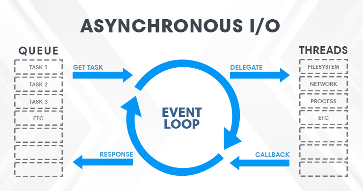
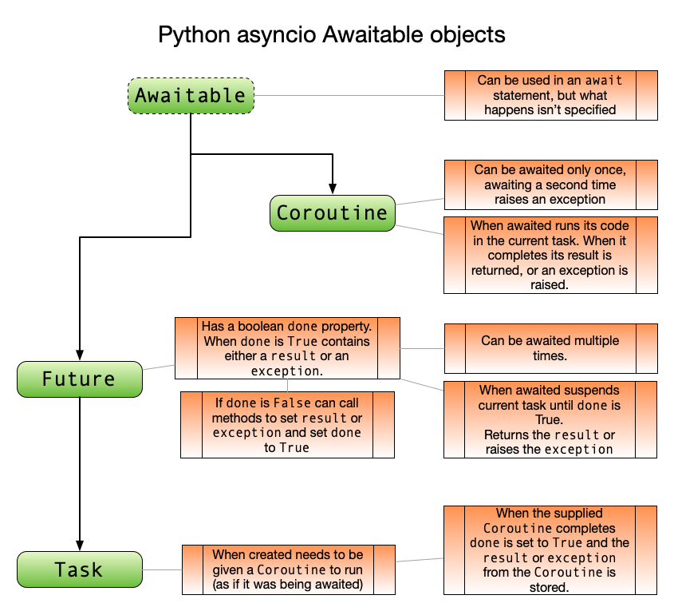
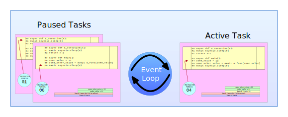

## [ASYNCIO](https://docs.python.org/3/library/asyncio.html)

## [Asynchronous Code](https://fastapi.tiangolo.com/async/#asynchronous-code)

Asynchronous code just means that the language 💬 has a way to tell the computer / program 🤖 that at some point in the code, it 🤖 will have to wait for something else to finish somewhere else.
 Let's say that something else is called "slow-file" 📝.

So, during that time, the computer can go and do some other work, while "slow-file" 📝 finishes.
That "wait for something else" normally refers to I/O operations that are relatively "slow" (compared to the speed of the processor and the RAM memory), like waiting for:
* the data from the client to be sent through the network
* the data sent by your program to be received by the client through the network
* the contents of a file in the disk to be read by the system and given to your program
* the contents your program gave to the system to be written to disk
* a remote API operation
* a database operation to finish
* a database query to return the results

### Referências
* [Async/await and Blocking I/O-bound or CPU-bound Operations](https://stackoverflow.com/a/71517830)
* [asyncio-part-1](https://bbc.github.io/cloudfit-public-docs/asyncio/asyncio-part-1)
* [Intro to Asynchronous](https://hackersandslackers.com/python-concurrency-asyncio/)

### Async Eventloop

### Awaitables

### Tasks

