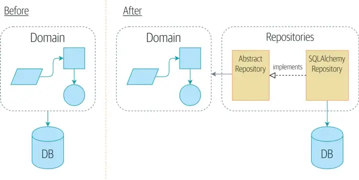

# Repository

## Inversion Principle Sqlalchemy


```
src/infra/adapters/repositories/partner.py
```
```python
from sqlalchemy.future import select

from src.infra.adapters.database.orm.models.partner import PartnerExample
from src.infra.adapters.repositories.sqlalchemy_repository import SqlAlchemyRepository


class RepositoryPartner(SqlAlchemyRepository):
    def __init__(self, session):
        super().__init__(session)
        self.entity_model = PartnerExample

    async def find_partner_by_document(self, document: str) -> PartnerExample:
        """Find partner by document
        :param document: The document of the Partner

        :return: PartnerExample
        """
        stmt = select(self.entity_model).where(self.entity_model.document == document)
        result = await self.session_db.execute(stmt)
        return result.scalars().first()

```


```
tests/conftest.py
```

```python
from datetime import datetime, timezone
import pytest_asyncio
from sqlalchemy import text
from src.infra.adapters.database.orm.settings import get_connection
from tests import create_test_database


async def insert_with_sql(sql):
    async with get_connection() as connection:
        result = await connection.execute(text(sql))
        assert result.rowcount == 1

async def select_with_sql(sql):
    async with get_connection() as connection:
        result = await connection.execute(text(sql))
        return result

@pytest_asyncio.fixture()
async def prepare_database():
    await create_test_database()
    data = datetime.now(timezone.utc).strftime('%Y-%m-%d %H:%M:%S-00')
    sql = (
        f'INSERT INTO partner_example (created_at, updated_at, canceled_at, document, name, active, '  # noqa Q000
        f"business_address) VALUES('{data}', "  # noqa Q000
        f"'{data}', null, '00623904000173', 'test solar', true, 'rua a');"  # noqa Q000
    )
    await insert_with_sql(sql)


```

```
tests/integration/repositories/test_repository_partner.py
```
```python
import logging
from datetime import datetime, timezone

import pytest
from sqlalchemy.exc import IntegrityError, NoResultFound

from src.infra.adapters.database.orm.models import PartnerExample
from src.infra.adapters.database.orm.settings import get_session
from src.infra.adapters.repositories.partner import RepositoryPartner
from src.schemas.schema_base import PaginateQuery
from tests.conftest import insert_with_sql, select_with_sql

logger = logging.getLogger(__name__)


@pytest.mark.asyncio()
@pytest.mark.usefixtures('create_database')
@pytest.mark.parametrize(
    ('limit', 'offset', 'sort', 'expected'),
    [
        (
            2,
            0,
            'created_at:desc',
            [
                ('2023-03-30 05:27:17-00', '53859112000169', 'Hunter Horne'),
                ('2023-03-29 21:23:07-00', '04172213000151', 'Isaac Weaver'),
            ],
        ),
        (
            2,
            2,
            'id:desc',
            [
                ('2023-03-25 18:44:19-00', '33050196000188', 'Carla Bowman'),
                ('2023-03-25 18:44:19-00', '06981180000116', 'Bailey Oconnell'),
            ],
        ),
        (
            2,
            2,
            'created_at:desc,name:asc',
            [
                ('2023-03-25 18:44:19-00', '06981180000116', 'Bailey Oconnell'),
                ('2023-03-25 18:44:19-00', '33050196000188', 'Carla Bowman'),
            ],
        ),
    ],
)
async def test_get_all_with_limit_offset_sort_should_return_two_models_by_time(limit, offset, sort, expected):
    # arrange
    inserts = [
        "INSERT INTO partner_example (created_at, updated_at, canceled_at, document, name, active, business_address) VALUES('2023-03-03 18:56:38-00', '2023-03-03 18:56:38-00', null, '12272084000100', 'Charles Lewis DDS', true, '673 Baldwin Flats Apt. 901\nLake Meghan, AR 96108');",  # noqa E501
        "INSERT INTO partner_example (created_at, updated_at, canceled_at, document, name, active, business_address) VALUES('2023-03-03 21:06:22-00', '2023-03-03 21:06:22-00', null, '03220438000173', 'Jonathon Melton', true, '90474 Johnson Lodge\nLake Paulborough, NJ 66934');",  # noqa E501
        "INSERT INTO partner_example (created_at, updated_at, canceled_at, document, name, active, business_address) VALUES('2023-03-08 17:27:45-00', '2023-03-08 17:27:45-00', null, '06272793000184', 'William Douglas', true, '5345 Sandra Light Apt. 907\nWest Tanya, AZ 28659');",  # noqa E501
        "INSERT INTO partner_example (created_at, updated_at, canceled_at, document, name, active, business_address) VALUES('2023-03-08 20:14:03-00', '2023-03-08 20:14:03-00', null, '06840748000189', 'Tom Goodwin', true, '4252 Davis Ports\nWilsonbury, DE 88953');",  # noqa E501
        "INSERT INTO partner_example (created_at, updated_at, canceled_at, document, name, active, business_address) VALUES('2023-03-09 02:25:19-00', '2023-03-09 02:25:19-00', null, '04895728000180', 'Anthony Saunders', true, '24441 Elizabeth Rapid Apt. 297\nLake Ronaldborough, AK 85494');",  # noqa E501
        "INSERT INTO partner_example (created_at, updated_at, canceled_at, document, name, active, business_address) VALUES('2023-03-09 06:51:23-00', '2023-03-09 06:51:23-00', null, '08467115000100', 'Renee Smith', true, 'USNV Smith\nFPO AE 95448');",  # noqa E501
        "INSERT INTO partner_example (created_at, updated_at, canceled_at, document, name, active, business_address) VALUES('2023-03-10 18:11:04-00', '2023-03-10 18:11:04-00', null, '15139629000194', 'Noah Wheeler', true, '146 Allen Points Apt. 574\nLake Glennhaven, VT 41237');",  # noqa E501
        "INSERT INTO partner_example (created_at, updated_at, canceled_at, document, name, active, business_address) VALUES('2023-03-13 05:51:53-00', '2023-03-13 05:51:53-00', null, '10835932000108', 'Stephanie Morris', true, '482 Ariel Islands\nDavidfurt, PW 66145');",  # noqa E501
        "INSERT INTO partner_example (created_at, updated_at, canceled_at, document, name, active, business_address) VALUES('2023-03-15 07:46:05-00', '2023-03-15 07:46:05-00', null, '08324196000181', 'Timothy Abbott', true, '3376 Ana Alley Apt. 620\nEast Tyler, OH 01498');",  # noqa E501
        "INSERT INTO partner_example (created_at, updated_at, canceled_at, document, name, active, business_address) VALUES('2023-03-15 11:00:56-00', '2023-03-15 11:00:56-00', null, '04065033000170', 'Jeremy Banks', true, '3123 Mann Villages\nMarissaland, VT 71079');",  # noqa E501
        "INSERT INTO partner_example (created_at, updated_at, canceled_at, document, name, active, business_address) VALUES('2023-03-15 17:30:33-00', '2023-03-15 17:30:33-00', null, '19527639000158', 'Bradley Carpenter', true, '34793 Hardin Dam Apt. 046\nEast Terry, AR 60911');",  # noqa E501
        "INSERT INTO partner_example (created_at, updated_at, canceled_at, document, name, active, business_address) VALUES('2023-03-16 22:24:25-00', '2023-03-16 22:24:25-00', null, '15413826000150', 'Joseph Green', true, '828 Vance Bridge Apt. 624\nNew Jacqueline, PW 54343');",  # noqa E501
        "INSERT INTO partner_example (created_at, updated_at, canceled_at, document, name, active, business_address) VALUES('2023-03-18 16:22:38-00', '2023-03-18 16:22:38-00', null, '03467321000199', 'Briana Parsons', true, '12522 Ellen Throughway Suite 015\nKimberlymouth, DE 66530');",  # noqa E501
        "INSERT INTO partner_example (created_at, updated_at, canceled_at, document, name, active, business_address) VALUES('2023-03-19 00:09:42-00', '2023-03-19 00:09:42-00', null, '09095183000140', 'Tracy Brown', true, '6280 Michelle Hill Suite 231\nThomasland, WV 17263');",  # noqa E501
        "INSERT INTO partner_example (created_at, updated_at, canceled_at, document, name, active, business_address) VALUES('2023-03-20 17:10:33-00', '2023-03-20 17:10:33-00', null, '33249046000106', 'Susan Gonzalez', true, '807 Rice Lakes\nWest Cory, NY 54861');",  # noqa E501
        "INSERT INTO partner_example (created_at, updated_at, canceled_at, document, name, active, business_address) VALUES('2023-03-21 14:59:29-00', '2023-03-21 14:59:29-00', null, '05914650000166', 'Mark Meyers', true, '757 Schwartz Village Suite 318\nNew Jason, MO 10416');",  # noqa E501
        "INSERT INTO partner_example (created_at, updated_at, canceled_at, document, name, active, business_address) VALUES('2023-03-23 13:22:30-00', '2023-03-23 13:22:30-00', null, '13017462000163', 'Alexandra Dickerson', true, '830 Marie Glen Suite 786\nNortonport, RI 38869');",  # noqa E501
        "INSERT INTO partner_example (created_at, updated_at, canceled_at, document, name, active, business_address) VALUES('2023-03-24 07:15:27-00', '2023-03-24 07:15:27-00', null, '07282377008104', 'Robert Beasley', true, '7122 Wilson Points\nPoolemouth, PR 13326');",  # noqa E501
        "INSERT INTO partner_example (created_at, updated_at, canceled_at, document, name, active, business_address) VALUES('2023-03-24 07:16:40-00', '2023-03-24 07:16:40-00', null, '25086034000171', 'Christina Garcia', true, '937 Burch Tunnel\nSouth Elizabethfurt, AS 31166');",  # noqa E501
        "INSERT INTO partner_example (created_at, updated_at, canceled_at, document, name, active, business_address) VALUES('2023-03-25 18:44:19-00', '2023-03-25 18:44:19-00', null, '06981180000116', 'Bailey Oconnell', true, '0923 Barry Springs Suite 222\nSouth Travis, OK 29424');",  # noqa E501
        "INSERT INTO partner_example (created_at, updated_at, canceled_at, document, name, active, business_address) VALUES('2023-03-25 18:44:19-00', '2023-03-25 18:44:19-00', null, '33050196000188', 'Carla Bowman', true, '6345 Jennings Keys\nLake Holly, SD 28200');",  # noqa E501
        "INSERT INTO partner_example (created_at, updated_at, canceled_at, document, name, active, business_address) VALUES('2023-03-29 21:23:07-00', '2023-03-29 21:23:07-00', null, '04172213000151', 'Isaac Weaver', true, '5090 Heather Junctions\nJonesshire, DC 89899');",  # noqa E501
        "INSERT INTO partner_example (created_at, updated_at, canceled_at, document, name, active, business_address) VALUES('2023-03-30 05:27:17-00', '2023-03-30 05:27:17-00', null, '53859112000169', 'Hunter Horne', true, '2908 Ashley Passage Apt. 669\nSierraview, NE 93866');",  # noqa E501
    ]

    for insert in inserts:
        await insert_with_sql(insert)

    # act
    async with get_session() as session:
        repository = RepositoryPartner(session=session)
        query = PaginateQuery(limit=limit, offset=offset, sort=sort)
        entitys, total = await repository.get_all(query=query)

    # assert
    assert total == 23
    for i in range(len(entitys)):
        created_at, document, name = expected[i]
        assert entitys[i].created_at.strftime('%Y-%m-%d %H:%M:%S-00') == created_at
        assert entitys[i].document == document
        assert entitys[i].name == name


@pytest.mark.asyncio()
@pytest.mark.usefixtures('create_database')
async def test_get_all_should_return_all_entitys():
    # arrange
    inserts = [
        "INSERT INTO partner_example (created_at, updated_at, canceled_at, document, name, active, business_address) VALUES('2023-03-03 18:56:38-00', '2023-03-03 18:56:38-00', null, '12272084000100', 'Charles Lewis DDS', true, '673 Baldwin Flats Apt. 901\nLake Meghan, AR 96108');",  # noqa E501
        "INSERT INTO partner_example (created_at, updated_at, canceled_at, document, name, active, business_address) VALUES('2023-03-03 21:06:22-00', '2023-03-03 21:06:22-00', null, '03220438000173', 'Jonathon Melton', true, '90474 Johnson Lodge\nLake Paulborough, NJ 66934');",  # noqa E501
        "INSERT INTO partner_example (created_at, updated_at, canceled_at, document, name, active, business_address) VALUES('2023-03-08 17:27:45-00', '2023-03-08 17:27:45-00', null, '06272793000184', 'William Douglas', true, '5345 Sandra Light Apt. 907\nWest Tanya, AZ 28659');",  # noqa E501
        "INSERT INTO partner_example (created_at, updated_at, canceled_at, document, name, active, business_address) VALUES('2023-03-08 20:14:03-00', '2023-03-08 20:14:03-00', null, '06840748000189', 'Tom Goodwin', true, '4252 Davis Ports\nWilsonbury, DE 88953');",  # noqa E501
        "INSERT INTO partner_example (created_at, updated_at, canceled_at, document, name, active, business_address) VALUES('2023-03-09 02:25:19-00', '2023-03-09 02:25:19-00', null, '04895728000180', 'Anthony Saunders', true, '24441 Elizabeth Rapid Apt. 297\nLake Ronaldborough, AK 85494');",  # noqa E501
        "INSERT INTO partner_example (created_at, updated_at, canceled_at, document, name, active, business_address) VALUES('2023-03-09 06:51:23-00', '2023-03-09 06:51:23-00', null, '08467115000100', 'Renee Smith', true, 'USNV Smith\nFPO AE 95448');",  # noqa E501
        "INSERT INTO partner_example (created_at, updated_at, canceled_at, document, name, active, business_address) VALUES('2023-03-10 18:11:04-00', '2023-03-10 18:11:04-00', null, '15139629000194', 'Noah Wheeler', true, '146 Allen Points Apt. 574\nLake Glennhaven, VT 41237');",  # noqa E501
        "INSERT INTO partner_example (created_at, updated_at, canceled_at, document, name, active, business_address) VALUES('2023-03-13 05:51:53-00', '2023-03-13 05:51:53-00', null, '10835932000108', 'Stephanie Morris', true, '482 Ariel Islands\nDavidfurt, PW 66145');",  # noqa E501
        "INSERT INTO partner_example (created_at, updated_at, canceled_at, document, name, active, business_address) VALUES('2023-03-15 07:46:05-00', '2023-03-15 07:46:05-00', null, '08324196000181', 'Timothy Abbott', true, '3376 Ana Alley Apt. 620\nEast Tyler, OH 01498');",  # noqa E501
        "INSERT INTO partner_example (created_at, updated_at, canceled_at, document, name, active, business_address) VALUES('2023-03-15 11:00:56-00', '2023-03-15 11:00:56-00', null, '04065033000170', 'Jeremy Banks', true, '3123 Mann Villages\nMarissaland, VT 71079');",  # noqa E501
        "INSERT INTO partner_example (created_at, updated_at, canceled_at, document, name, active, business_address) VALUES('2023-03-15 17:30:33-00', '2023-03-15 17:30:33-00', null, '19527639000158', 'Bradley Carpenter', true, '34793 Hardin Dam Apt. 046\nEast Terry, AR 60911');",  # noqa E501
        "INSERT INTO partner_example (created_at, updated_at, canceled_at, document, name, active, business_address) VALUES('2023-03-16 22:24:25-00', '2023-03-16 22:24:25-00', null, '15413826000150', 'Joseph Green', true, '828 Vance Bridge Apt. 624\nNew Jacqueline, PW 54343');",  # noqa E501
        "INSERT INTO partner_example (created_at, updated_at, canceled_at, document, name, active, business_address) VALUES('2023-03-18 16:22:38-00', '2023-03-18 16:22:38-00', null, '03467321000199', 'Briana Parsons', true, '12522 Ellen Throughway Suite 015\nKimberlymouth, DE 66530');",  # noqa E501
        "INSERT INTO partner_example (created_at, updated_at, canceled_at, document, name, active, business_address) VALUES('2023-03-19 00:09:42-00', '2023-03-19 00:09:42-00', null, '09095183000140', 'Tracy Brown', true, '6280 Michelle Hill Suite 231\nThomasland, WV 17263');",  # noqa E501
        "INSERT INTO partner_example (created_at, updated_at, canceled_at, document, name, active, business_address) VALUES('2023-03-20 17:10:33-00', '2023-03-20 17:10:33-00', null, '33249046000106', 'Susan Gonzalez', true, '807 Rice Lakes\nWest Cory, NY 54861');",  # noqa E501
        "INSERT INTO partner_example (created_at, updated_at, canceled_at, document, name, active, business_address) VALUES('2023-03-21 14:59:29-00', '2023-03-21 14:59:29-00', null, '05914650000166', 'Mark Meyers', true, '757 Schwartz Village Suite 318\nNew Jason, MO 10416');",  # noqa E501
        "INSERT INTO partner_example (created_at, updated_at, canceled_at, document, name, active, business_address) VALUES('2023-03-23 13:22:30-00', '2023-03-23 13:22:30-00', null, '13017462000163', 'Alexandra Dickerson', true, '830 Marie Glen Suite 786\nNortonport, RI 38869');",  # noqa E501
        "INSERT INTO partner_example (created_at, updated_at, canceled_at, document, name, active, business_address) VALUES('2023-03-24 07:15:27-00', '2023-03-24 07:15:27-00', null, '07282377008104', 'Robert Beasley', true, '7122 Wilson Points\nPoolemouth, PR 13326');",  # noqa E501
        "INSERT INTO partner_example (created_at, updated_at, canceled_at, document, name, active, business_address) VALUES('2023-03-24 07:16:40-00', '2023-03-24 07:16:40-00', null, '25086034000171', 'Christina Garcia', true, '937 Burch Tunnel\nSouth Elizabethfurt, AS 31166');",  # noqa E501
        "INSERT INTO partner_example (created_at, updated_at, canceled_at, document, name, active, business_address) VALUES('2023-03-25 18:44:19-00', '2023-03-25 18:44:19-00', null, '06981180000116', 'Bailey Oconnell', true, '0923 Barry Springs Suite 222\nSouth Travis, OK 29424');",  # noqa E501
        "INSERT INTO partner_example (created_at, updated_at, canceled_at, document, name, active, business_address) VALUES('2023-03-25 18:44:19-00', '2023-03-25 18:44:19-00', null, '33050196000188', 'Carla Bowman', true, '6345 Jennings Keys\nLake Holly, SD 28200');",  # noqa E501
        "INSERT INTO partner_example (created_at, updated_at, canceled_at, document, name, active, business_address) VALUES('2023-03-29 21:23:07-00', '2023-03-29 21:23:07-00', null, '04172213000151', 'Isaac Weaver', true, '5090 Heather Junctions\nJonesshire, DC 89899');",  # noqa E501
        "INSERT INTO partner_example (created_at, updated_at, canceled_at, document, name, active, business_address) VALUES('2023-03-30 05:27:17-00', '2023-03-30 05:27:17-00', null, '53859112000169', 'Hunter Horne', true, '2908 Ashley Passage Apt. 669\nSierraview, NE 93866');",  # noqa E501
    ]

    for insert in inserts:
        await insert_with_sql(insert)

    # act
    async with get_session() as session:
        repository = RepositoryPartner(session=session)
        entitys, total = await repository.get_all()

    # assert
    assert total == 23
    assert len(entitys) == 23


@pytest.mark.asyncio()
@pytest.mark.usefixtures('create_database')
async def test_get_all_should_return_valid_list_models():
    # arrange
    data = datetime.now(timezone.utc).strftime('%Y-%m-%d %H:%M:%S-00')
    cnpj = '00623904000173'
    name = 'solar city'
    business_address = 'rua a'
    sql = (
        f'INSERT INTO partner_example (created_at, updated_at, canceled_at, document, name, active, '  # noqa Q000
        f"business_address) VALUES('{data}', "  # noqa Q000
        f"'{data}', null, '{cnpj}', '{name}', true, '{business_address}');"  # noqa Q000
    )
    await insert_with_sql(sql)

    # act
    async with get_session() as session:
        repository = RepositoryPartner(session=session)
        entitys, total = await repository.get_all()

    # assert
    assert entitys[0].id == 1
    assert entitys[0].document == cnpj
    assert entitys[0].name == name
    assert entitys[0].active
    assert entitys[0].business_address == business_address
    assert total == 1


@pytest.mark.asyncio()
@pytest.mark.usefixtures('prepare_database')
async def test_get_all_should_return_empty_list():
    # act
    async with get_session() as session:
        repository = RepositoryPartner(session=session)
        entitys, total = await repository.get_all()

    # assert
    assert len(entitys) == 1
    assert total == 1


@pytest.mark.asyncio()
@pytest.mark.usefixtures('create_database')
async def test_get_by_id_should_raises_exception():
    # act
    async with get_session() as session:
        repository = RepositoryPartner(session=session)
        with pytest.raises(NoResultFound) as error:
            await repository.get_by_id(model_id=1)

    # assert
    assert error.value.args[0] == 'No row was found when one was required'
    assert error.typename == 'NoResultFound'


@pytest.mark.asyncio()
@pytest.mark.usefixtures('prepare_database')
async def test_get_by_id_should_return_valid_model():
    # act
    async with get_session() as session:
        repository = RepositoryPartner(session=session)
        entity = await repository.get_by_id(model_id=1)

    # assert
    assert isinstance(entity, PartnerExample)
    assert entity.id == 1
    assert entity.document == '00623904000173'


@pytest.mark.asyncio()
@pytest.mark.usefixtures('prepare_database')
async def test_find_by_id_should_return_valid_model():
    # act
    async with get_session() as session:
        repository = RepositoryPartner(session=session)
        entity = await repository.find_by_id(model_id=1)

    # assert
    assert isinstance(entity, PartnerExample)
    assert entity.id == 1
    assert entity.document == '00623904000173'


@pytest.mark.asyncio()
@pytest.mark.usefixtures('create_database')
async def test_find_by_id_should_return_none():
    # act
    async with get_session() as session:
        repository = RepositoryPartner(session=session)
        entity = await repository.find_by_id(model_id=1)

    # assert
    assert not entity


@pytest.mark.asyncio()
@pytest.mark.usefixtures('create_database')
async def test_save_when_model_is_valid_should_return_model_persisted():
    # arrange
    partner = PartnerExample(document='00623904000173', name='test solar', active=True, business_address='rua a')
    # act
    async with get_session() as session:
        repository = RepositoryPartner(session=session)
        entity = await repository.save(model=partner)

    # assert
    assert isinstance(entity, PartnerExample)
    assert entity.document == partner.document
    assert entity.name == partner.name
    assert entity.active == partner.active
    assert entity.business_address == partner.business_address
    assert entity.updated_at
    assert entity.created_at
    assert not entity.canceled_at


@pytest.mark.asyncio()
@pytest.mark.usefixtures('create_database')
async def test_save_when_model_is_not_valid_should_raised_exception():
    # arrange
    partner = PartnerExample(name='test solar', active=True, business_address='rua a')
    # act
    with pytest.raises(IntegrityError) as error:  # noqa PT012
        async with get_session() as session:
            repository = RepositoryPartner(session=session)
            await repository.save(model=partner)

    # assert
    assert error.typename == 'IntegrityError'


@pytest.mark.asyncio()
@pytest.mark.usefixtures('prepare_database')
async def test_update_when_model_is_not_valid_should_raised_exception():
    # arrange
    model_id = 1

    # act
    with pytest.raises(IntegrityError) as error:  # noqa PT012
        async with get_session() as session:
            repository = RepositoryPartner(session=session)
            await repository.update(model_id=model_id, values={'name': None})

    # assert
    assert error.typename == 'IntegrityError'


@pytest.mark.asyncio()
@pytest.mark.usefixtures('prepare_database')
async def test_update_when_new_value_valid_should_return_new_value_from_database():
    # arrange
    model_id = 1
    new_name = 'solar center'
    # act
    async with get_session() as session:
        repository = RepositoryPartner(session=session)
        await repository.update(model_id=model_id, values={'name': new_name})

    # assert
    async with get_session() as session:
        repository = RepositoryPartner(session=session)
        partner = await repository.get_by_id(model_id=1)
    assert partner.name == new_name


@pytest.mark.asyncio()
@pytest.mark.usefixtures('prepare_database')
async def test_update_when_new_value_valid_and_occurs_error_should_return_old_value_from_database():
    # arrange
    model_id = 1
    old_name = 'test solar'
    new_name = 'solar center'
    # act
    try:
        async with get_session() as session:
            repository = RepositoryPartner(session=session)
            await repository.update(model_id=model_id, values={'name': new_name})

            partner = await repository.get_by_id(model_id=1)
            assert partner.name == new_name

            raise Exception()
    except Exception as ex:
        logger.exception(ex)
        async with get_session() as session:
            partner = await RepositoryPartner(session=session).get_by_id(model_id=1)

    # assert
    assert partner.name == old_name


@pytest.mark.asyncio()
@pytest.mark.usefixtures('prepare_database')
async def test_delete_when_not_occur_error_should_delete_data():
    # arrange
    sql = 'select count(*) from partner_example'
    async with get_session() as session:
        repository = RepositoryPartner(session=session)
        partner = await repository.get_by_id(model_id=1)

    # act
    async with get_session() as session:
        repository = RepositoryPartner(session=session)
        await repository.delete(partner)

    result = await select_with_sql(sql)

    # assert
    assert result.scalar() == 0


@pytest.mark.asyncio()
@pytest.mark.usefixtures('prepare_database')
async def test_delete_when_occur_error_should_not_delete_data():
    # arrange
    sql = 'select count(*) from partner_example'
    async with get_session() as session:
        repository = RepositoryPartner(session=session)
        partner = await repository.get_by_id(model_id=1)

    # act
    try:
        async with get_session() as session:
            repository = RepositoryPartner(session=session)
            await repository.delete(partner)
            raise Exception()
    except Exception as ex:
        logger.exception(ex)
    result = await select_with_sql(sql)

    # assert
    assert result.scalar() == 1


@pytest.mark.asyncio()
@pytest.mark.usefixtures('prepare_database')
async def test_delete_with_select_data_should_not_return_data():
    # arrange
    model_id = 1
    async with get_session() as session:
        repository = RepositoryPartner(session=session)
        partner = await repository.get_by_id(model_id=model_id)

    # act
    with pytest.raises(NoResultFound) as error:  # noqa PT012
        async with get_session() as session:
            repository = RepositoryPartner(session=session)
            partner = await repository.get_by_id(model_id=model_id)
            await repository.delete(partner)
            await repository.get_by_id(model_id=model_id)

    # assert
    assert error.value.args[0] == 'No row was found when one was required'
    assert error.typename == 'NoResultFound'
```
