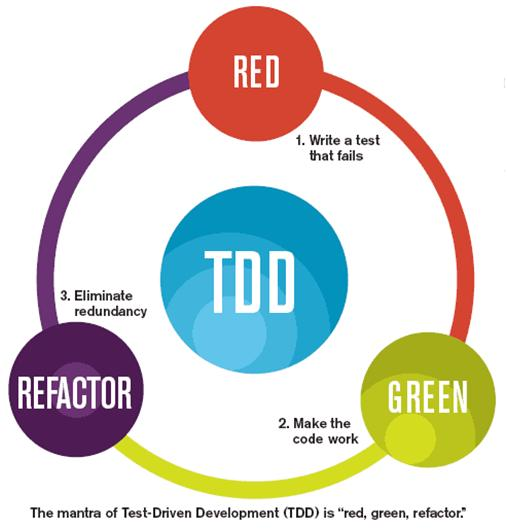
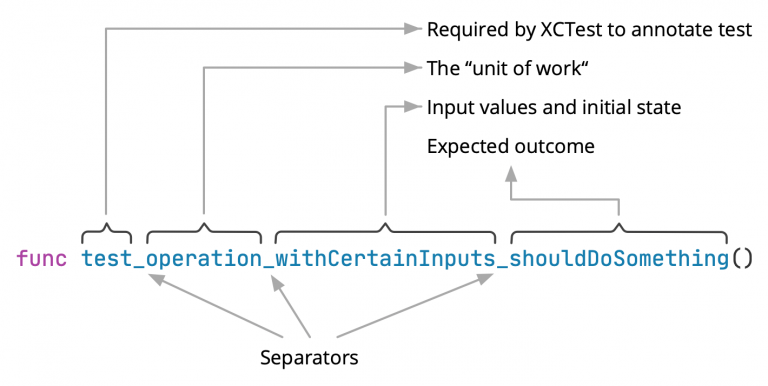
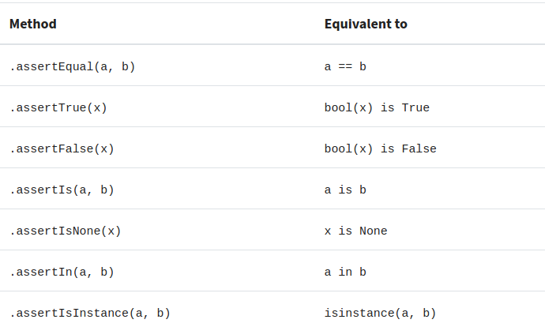

# Testing

This project uses [pytest](https://docs.pytest.org/).

There are three sets of tests that can be found in the `tests` folder. Are they:

- unit: test small units of code, isolating them from external dependencies, such as the database or a external cache;
- integration: test the database abstraction layer and other integrations, verifying that the methods reflect correctly in this services and vice versa;
- end-to-end: test the API, verifying that the calls to the endpoints have the expected return, united within a context of use (ex: check if there are open bank billets, then check the link to download the bank billet etc.)

The folder structure can be given briefly by:

```
.
└── tests/
    ├── e2e/
    │   └── # End to end tests
    ├── integration/
    │   └── # Integration tests
    ├── unit/
    │   ├── # Unit tests
    ├── conftest.py # Some fixtures
```

Tests can be run with:

```console
make test
```

The asynchronous test suite was built with:

- pytest
- pytest-mock: which provides a fixture with mock features of Python's unittest module;
- httpx: for a test client supporting asynchronous requests;
- asgi-lifespan: to be able to test the api without having to upload the server;
- pytest-asyncio: for testing asynchronous code with pytest.

Test Driven Development

* Tdd ciclo



* Tdd the pyramyd of tests


* Tdd Test Naming


* Unittest vs Pytest

